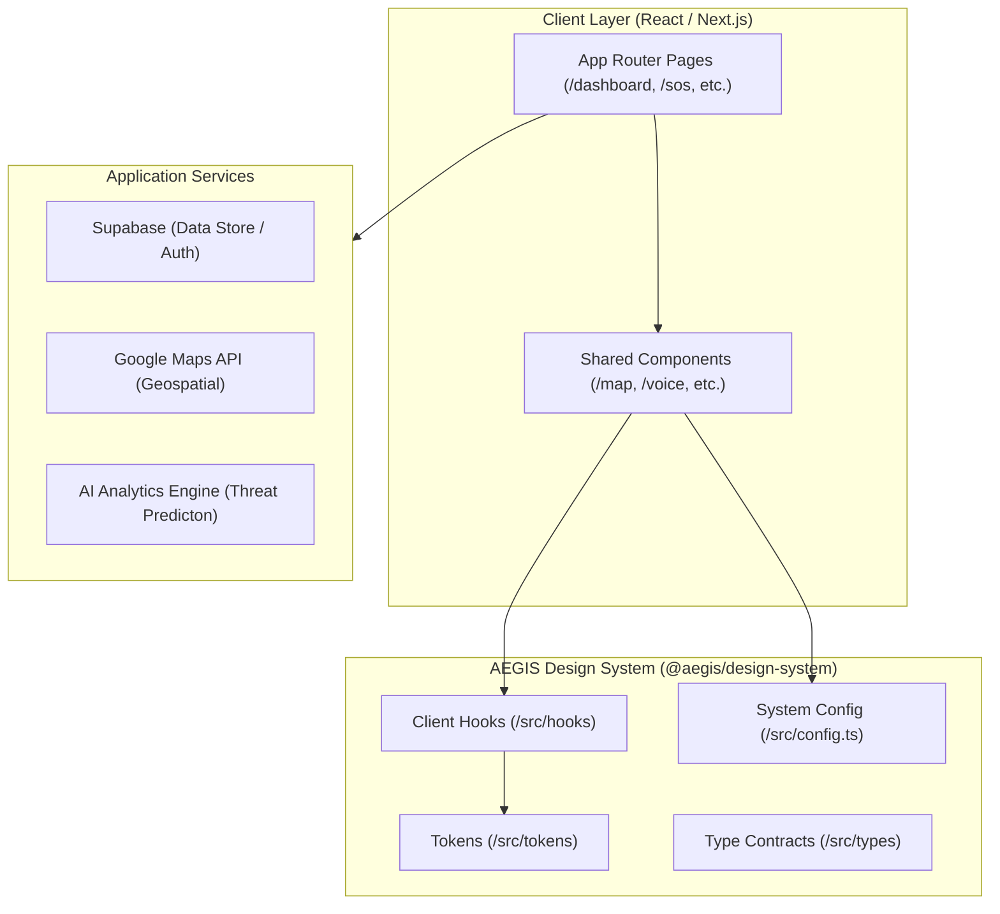

# AEGIS System Architecture

This document describes the high-level architecture of the AEGIS global protective intelligence platform.

## Directory Structure

The project is structured as a monorepo workspace split into two main sections:
1. **Workspace Root**: Orchestration configuration and documentation.
2. **Frontend Subdirectory (`/frontend`)**: Next.js 16 Web Application.

Inside `/frontend/src/`:
- **`tokens/`**: Framework-agnostic static design variables (colors, motion, layout, breakpoints, spacing, typography). Free from React runtime imports.
- **`hooks/`**: Reactive hooks adapting design tokens to client context (`useBreakpoint`, `useMediaQuery`).
- **`types/`**: Strongly typed structural contracts.
- **`app/`**: Next.js App Router folders matching the security application routes:
  - `(auth)/login` & `(auth)/register`
  - `dashboard` (Central monitor split)
  - `reports` (Incident logs)
  - `safe-spaces` (Safe zones database)
  - `analytics` (Real-time threat charts)
  - `settings` (System preferences)
  - `sos` (Emergency control dispatch)
  - `api` (Serverless backend handlers)
- **`components/`**: Modular, highly reusable page-specific components separated by domain (`map`, `sos`, `voice`, `ui`, `layout`).

## Design Principles

1. **Separation of Concerns**: Pure tokens are strictly isolated from React runtime, allowing them to be parsed by Tailwind, tests, and non-browser render contexts.
2. **High-Performance Rendering**: Transition curves explicitly animate GPU-composited variables (`opacity`, `transform`) instead of triggering layout reflow properties (`width`, `height`).
3. **Responsive Adaptive Viewports**: Breakpoint evaluations use `matchMedia` event listeners to delegate responsiveness to native Web APIs.
